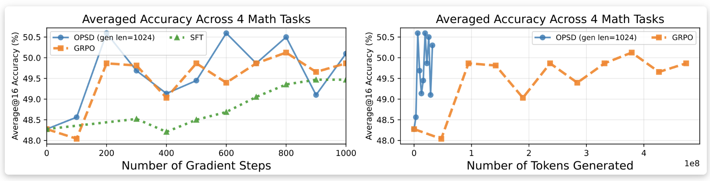

# Self-Distilled Reasoner: On-Policy Self-Distillation for Large Language Models


<p align="center">
<a href="https://arxiv.org/abs/2601.18734"></a>
<a href="https://siyan-zhao.github.io/blog/2026/opsd/"></a>
</p>

---
## Overview

**On-Policy Self-Distillation (OPSD)** trains a single model to act as both student and teacher by conditioning on different contexts — the student sees only the problem, while the teacher additionally sees the ground-truth solution — and performs token-level distribution matching along the student's own on-policy trajectories.

OPSD achieves comparable or better performance while using 8-12× fewer generation tokens than GRPO (1k tokens vs 16k tokens.)

<p align="center"></p>

## Updates

- **Mar 5, 2026**: We fully opensourced our code with evaluation code released (`eval/`); environment configs updated.


## Installation


```bash
conda env create -f environment.yml
conda activate opsd
```

```bash
pip install flash-attn==2.8.3 --no-build-isolation
```

The code uses `trl`'s experimental GOLD trainer as a base.

## Repository Structure

```
├── opsd_trainer.py          # OPSDTrainer: core self-distillation trainer
├── data_collator.py         # Data collator for self-distillation
├── opsd_train.py            # OPSD training entry point
├── sft_train.py             # SFT baseline training entry point
├── grpo_train.py            # GRPO baseline training entry point
├── accelerate.yaml          # Accelerate config (multi-GPU)
├── scripts/
│   ├── run_opsd.sh          # Example launch script for OPSD
│   ├── run_opsd_ema.sh      # OPSD with EMA teacher
│   ├── run_opsd_topkloss.sh # OPSD with top-k vocabulary loss
│   ├── run_sft.sh           # Example launch script for SFT
│   └── run_grpo.sh          # Example launch script for GRPO
└── eval/
    ├── evaluate_math.py     # Evaluation script (vLLM)
    └── run_eval.sh          # Example evaluation script
```

## Quick Start

Reproduced results on Qwen3-1.7B (runs in ~3 hours on 8×H100):

```bash
bash scripts/run_opsd_1b.sh
```
Evaluation: 
```bash
cd eval
bash run_eval.sh
```

### Evaluation Results on AIME24 (Qwen3-1.7B)

| Checkpoint | Avg@16 |
|---|---|
| Base | 47.7% |
| 100 steps | 47.5% |
| 200 steps | 51.7% |
| 300 steps | 50.2% |
| 400 steps | 49.2% |
| 500 steps | 51.0% |

> **Evaluation settings:** temperature=1.0, thinking mode enabled, max new tokens=38912, top-p=none, top-k disabled, min-p=0, presence penalty=0, num samples=16


## Training


### OPSD

See [`scripts/run_opsd.sh`](scripts/run_opsd.sh). For EMA teacher and top-k vocabulary loss variants, see [`scripts/run_opsd_ema.sh`](scripts/run_opsd_ema.sh) and [`scripts/run_opsd_topkloss.sh`](scripts/run_opsd_topkloss.sh).

#### Key OPSD arguments

| Argument | Default | Description |
|---|---|---|
| `--fixed_teacher` | `False` | Fix the teacher to the initial policy (step 0). Requires `--use_peft`. Recommended. |
| `--use_ema_teacher` | `False` | Use an EMA of the student weights as the teacher instead of a fixed snapshot. See `run_opsd_ema.sh`. |
| `--ema_decay` | — | EMA decay rate for the teacher (e.g. 0.999). Only used when `--use_ema_teacher` is set. |
| `--top_k_loss` | — | Restrict distillation loss to the top-k teacher vocabulary entries. See `run_opsd_topkloss.sh`. |
| `--use_tinker_loss` | `False` | Use sampled-token policy-gradient objective instead of full-vocabulary JSD. More memory efficient. |
| `--max_completion_length` | — | Student generation length for distillation. We use 2048 in our main experiments. |
| `--beta` | — | Interpolation weight for the JSD mixture distribution. |
| `--reason_first` | `False` | Prepend an explicit rationalization to the teacher context before distillation. |
| `--run_config` | `None` | Custom name suffix for the output directory and WandB run. |

### SFT Baseline

See [`scripts/run_sft.sh`](scripts/run_sft.sh).

### GRPO Baseline

See [`scripts/run_grpo.sh`](scripts/run_grpo.sh).

### Implementation Note
Thanks to [issue #3](https://github.com/siyan-zhao/OPSD/issues/3), we identified a prompt format mismatch that originates from TRL's [`GOLDTrainer.py#L1680`](https://github.com/huggingface/trl/blob/v0.29.0/trl/experimental/gold/gold_trainer.py#L1680), which OPSD is built on: the student prompt lacks the Qwen3 chat template, while the teacher prompt follows the Qwen3 thinking-style chat template. The reported results correspond to this configuration, so we didn't fix the mismatch but only document it here for reproducibility — OPSD does not require student and teacher prompts to match, and both can be treated as optimizable components of the framework. For instance, the teacher prompt can be refined via prompt optimization techniques such as GEPA (https://arxiv.org/abs/2507.19457) to shape the supervising signal, while the student prompt can be varied to study which generation modes yield the most effective learning. We are experimenting with matched/unmatched/hybrid chat templates and will show comparison results in the future.


## Citation

```bibtex
@article{zhao2026self,
  title={Self-Distilled Reasoner: On-Policy Self-Distillation for Large Language Models},
  author={Zhao, Siyan and Xie, Zhihui and Liu, Mengchen and Huang, Jing and Pang, Guan and Chen, Feiyu and Grover, Aditya},
  journal={arXiv preprint arXiv:2601.18734},
  year={2026}
}
```
